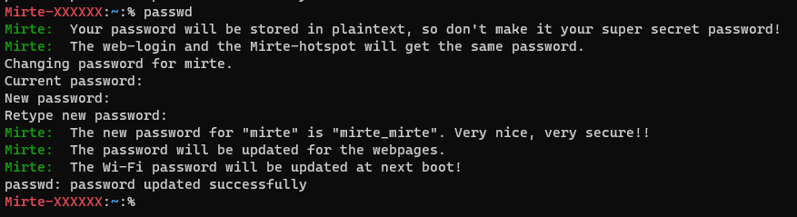

# password module

This system will show some info to the user when changing passwords and stores the new password in `/root/users.json`. The warnings are hooked in to `passwd` by using pam modules.

Output:




# Build
Building PAM modules requires `libpam0g-dev`:

```sh
sudo apt-get install libpam0g-dev
```

Building the Mirte PAM system:
```sh
mkdir build
cd build
cmake -DCMAKE_BUILD_TYPE=Release ..
make
make install # requires sudo privileges
```

This will build the Mirte pam modules(warning and storepassword), install them to `/lib/security/limbirte_pam_xxx.so` and add the required lines to `/etc/pam.d/passwd`.

# passwd
The resulting `/etc/pam.d/passwd` should look like:
```
#
# The PAM configuration file for the Shadow `passwd' service
#
password required /lib/security/libmirte_pam_warn.so
@include common-password
password required /lib/security/libmirte_pam_storepassword.so
```

The `warn` module is started before the actual passwd system, so the output will be before the passwd output. The storepassword is after it to catch the plaintext password.